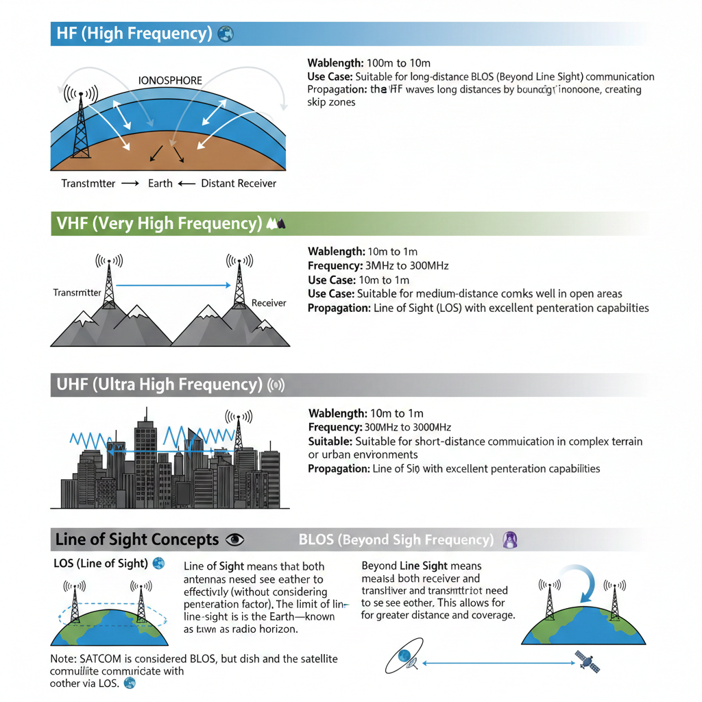
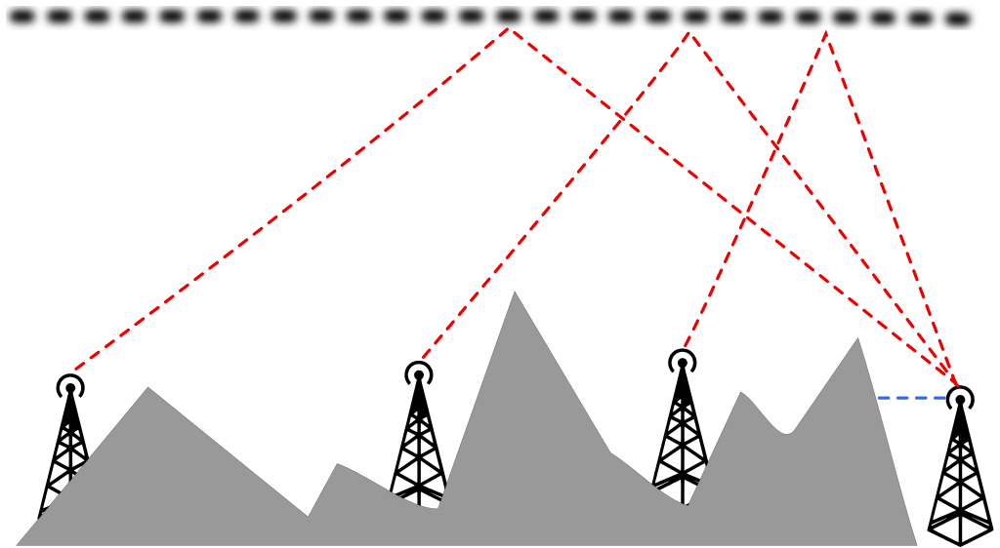

import { Aside, Badge, Card, CardGrid } from "@astrojs/starlight/components";
import Question from "../../../../components/Question.astro";
import Quiz from "../../../../components/Quiz.astro";
import Flashcard from "../../../../components/Flashcard.astro";
import MatchPairs from "../../../../components/MatchPairs.astro";
import ProgressCheck from "../../../../components/ProgressCheck.astro";
import Terminal from "../../../../components/Terminal.astro";
import FillBlank from "../../../../components/FillBlank.astro";

<Badge text="Radio" class="radio" />

Understanding radio theory is essential for amateur radio operators, RF engineers, and anyone working with wireless communications. This guide covers the electromagnetic spectrum, frequency bands, and propagation principles.

---

## 📺 Video Introduction

<iframe
  width="100%"
  height="400"
  src="https://www.youtube.com/embed/FWCN_uI5ygY"
  title="How Radio Waves Work"
  frameborder="0"
  allow="accelerometer; autoplay; clipboard-write; encrypted-media; gyroscope; picture-in-picture"
  allowfullscreen
></iframe>

> **Recommended**: "How Radio Waves Are Produced" - Explains electromagnetic wave fundamentals

---

## The Electromagnetic Spectrum

The electromagnetic spectrum is the complete range of electromagnetic radiation, organized by frequency or wavelength.

### Spectrum Bands

| Band             | Symbol | Characteristics          |
| ---------------- | ------ | ------------------------ |
| 📡 Radio waves   | RF     | 1m to 100km wavelength   |
| 🍕 Microwaves    | MW     | 1mm to 1m wavelength     |
| 🔥 Infrared      | IR     | Heat radiation           |
| 👁️ Visible light | VIS    | Human-visible spectrum   |
| ☀️ Ultraviolet   | UV     | Higher energy light      |
| 🦴 X-rays        | X      | Medical imaging          |
| ☢️ Gamma rays    | γ      | Highest energy radiation |

<Aside type="note">
  Electromagnetic waves in each band have different characteristics — how they
  are produced, how they interact with matter, and their practical applications.
</Aside>

<Question
  question="What determines where a wave falls on the electromagnetic spectrum?"
  answer="Its frequency or wavelength. Lower frequencies have longer wavelengths, higher frequencies have shorter wavelengths."
/>

---

## Radio Frequency Bands

We use three primary types of radio frequencies: **HF**, **VHF**, and **UHF**.

### HF (High Frequency)

| Property    | Value                       |
| ----------- | --------------------------- |
| Wavelength  | 100m to 10m                 |
| Frequency   | 3MHz to 30MHz               |
| Propagation | Ionospheric skip (BLOS)     |
| Use Case    | Long-distance communication |

<Aside type="tip">
  HF waves travel long distances by bouncing off the ionosphere, creating skip
  zones.
</Aside>

---

### VHF (Very High Frequency)

| Property    | Value                       |
| ----------- | --------------------------- |
| Wavelength  | 10m to 1m                   |
| Frequency   | 30MHz to 300MHz             |
| Propagation | Line of Sight (LOS)         |
| Use Case    | Medium-distance, open areas |

---

### UHF (Ultra High Frequency)

| Property    | Value                                 |
| ----------- | ------------------------------------- |
| Wavelength  | 1m to 30cm                            |
| Frequency   | 300MHz to 3000MHz                     |
| Propagation | Line of Sight (LOS)                   |
| Use Case    | Short-distance, urban/complex terrain |

<Aside type="note">
  UHF has excellent penetration capabilities, making it ideal for urban
  environments.
</Aside>

<Flashcard
  title="Frequency Band Characteristics"
  cards={[
    {
      front: "HF Range",
      back: "3MHz to 30MHz — Long-distance BLOS via ionospheric skip",
    },
    {
      front: "VHF Range",
      back: "30MHz to 300MHz — Medium range, line of sight, open areas",
    },
    {
      front: "UHF Range",
      back: "300MHz to 3000MHz — Short range, excellent building penetration",
    },
    {
      front: "Longer wavelength effect",
      back: "Can travel farther distances (ELF can circle the planet)",
    },
    {
      front: "Higher frequency effect",
      back: "More data capacity but shorter propagation distance",
    },
  ]}
/>

---

## Line of Sight Concepts

### LOS (Line of Sight)

Both antennas need to "see" each other to transmit effectively. The limit is the Earth's curvature — the **radio horizon**.

### BLOS (Beyond Line of Sight)

Transmitter and receiver do not need direct visibility, allowing greater distance and coverage.

<Aside type="note">
  SATCOM is considered BLOS, but the dish and satellite communicate via LOS.
</Aside>

<Question
  question="Why can HF communicate beyond line of sight?"
  answer="HF waves bounce off the ionosphere, allowing them to travel beyond the radio horizon and reach distant receivers."
/>

---

## Frequency Comparison

<MatchPairs
  title="Match Frequency Band to Best Use Case"
  pairs={[
    { left: "HF", right: "Long-distance BLOS" },
    { left: "VHF", right: "Open area medium range" },
    { left: "UHF", right: "Urban/complex terrain" },
    { left: "SATCOM", right: "Global coverage via satellite" },
  ]}
/>

### Why HF Over SATCOM?

We prefer HF for BLOS communication because it operates **independently** — no reliance on external infrastructure like satellites.

| Band    | Advantages                                        | Disadvantages                             |
| ------- | ------------------------------------------------- | ----------------------------------------- |
| **HF**  | Independent, long-range BLOS                      | Skip zones, low bandwidth, large antennas |
| **VHF** | Balanced range/performance                        | Less effective in complex terrain         |
| **UHF** | Great penetration, small antennas, high bandwidth | Short range, weather-sensitive            |

---

## Modulation Types

### AM (Amplitude Modulation)

Varies the **amplitude** (voltage strength) of the carrier wave.

- Greater transmission distance
- More susceptible to noise
- Used in aircraft communication ✈️

### FM (Frequency Modulation)

Varies the **frequency** of the carrier wave.

- Better voice quality
- More resistant to interference
- Signal drops rapidly when fading
- Common in VHF/UHF radios

<Quiz
  question="Which modulation type provides better voice quality but drops rapidly when fading?"
  options={["AM", "FM", "QAM", "P25"]}
  correct={1}
  explanation="FM provides better voice quality and interference resistance, but the signal drops rapidly once it begins to fade, unlike AM which degrades gradually."
/>

---

## NVIS (Near Vertical Incidence Skywave)

NVIS aims the signal almost straight up, causing it to bounce back down closer to the transmitter.

### NVIS Advantages

- Reduces or eliminates skip zones
- Harder to detect and locate transmitter
- Reliable regional coverage (0-400 km radius)
- Works in mountainous terrain where LOS is blocked

<Aside type="tip">
  Use NVIS for short to medium-range HF when you need BLOS coverage without
  large skip zones.
</Aside>

---

## Knowledge Check

<MatchPairs
  instruction="Match the frequency band with its characteristics"
  pairs={[
    { left: "HF", right: "Ionospheric skip, long-distance" },
    { left: "VHF", right: "Line of sight, medium range" },
    { left: "UHF", right: "Good building penetration" },
    { left: "AM", right: "Greater distance, more noise" },
  ]}
/>

<Terminal
  commands={[
    {
      input: "rtl_test -t",
      output: "Found 1 device(s):\n  0:  Realtek, RTL2838UHIDIR",
    },
  ]}
/>

<FillBlank
  instruction="Complete the acronym:"
  sentence="[BLANK:BLOS] stands for Beyond Line of Sight communication"
/>

<Quiz
  question="What is the main advantage of UHF over HF?"
  options={[
    "Longer range",
    "Better building penetration with smaller antennas",
    "Can bounce off ionosphere",
    "Lower power requirements",
  ]}
  correct={1}
  explanation="UHF's shorter wavelengths allow better penetration through obstacles and require smaller, more portable antennas."
/>

<Quiz
  question="What does BLOS stand for?"
  options={[
    "Basic Line of Signal",
    "Beyond Line of Sight",
    "Broadband Local Operating System",
    "Band Limited Output Signal",
  ]}
  correct={1}
  explanation="BLOS = Beyond Line of Sight, meaning transmitter and receiver don't need direct visibility."
/>

<Question
  question="Why does NVIS reduce skip zones?"
  answer="By aiming the signal nearly straight up, it bounces back down close to the transmitter instead of skipping over nearby areas."
/>

---

## Progress Tracker

<ProgressCheck
  id="radio-fundamentals"
  title="Radio Theory Checklist"
  items={[
    "Understand the electromagnetic spectrum",
    "Know HF, VHF, UHF frequency ranges",
    "Understand LOS vs BLOS propagation",
    "Know AM vs FM modulation differences",
    "Understand NVIS technique and benefits",
  ]}
/>

---

## 📚 Sources & References

<Aside type="note" title="Learn More">
  This article covers fundamental radio theory concepts for understanding
  electromagnetic spectrum communication.
</Aside>

### Official Resources

- [ARRL - Understanding Basic Electronics](http://www.arrl.org/) — Amateur Radio Relay League
- [ITU Radio Regulations](https://www.itu.int/) — International Telecommunication Union

### Recommended Reading

- [Wikipedia - Radio Spectrum](https://en.wikipedia.org/wiki/Radio_spectrum) — Frequency band overview
- [Electronics Notes - Radio Propagation](https://www.electronics-notes.com/articles/antennas-propagation/) — Propagation fundamentals
